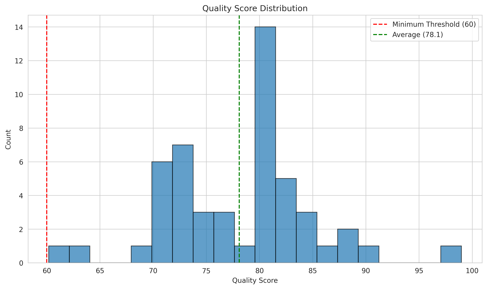
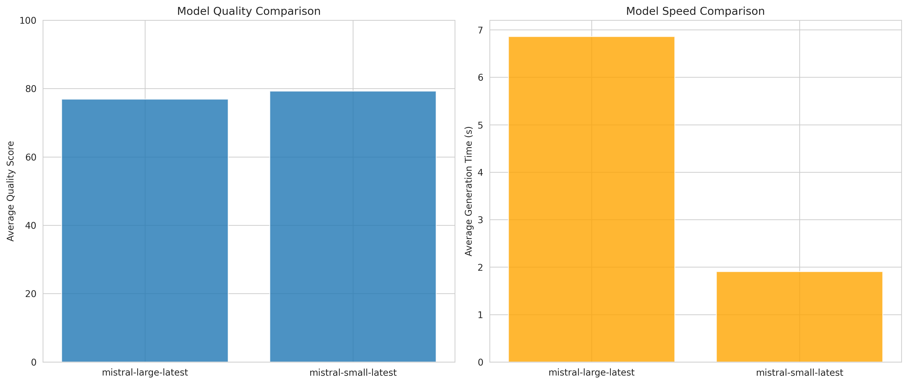
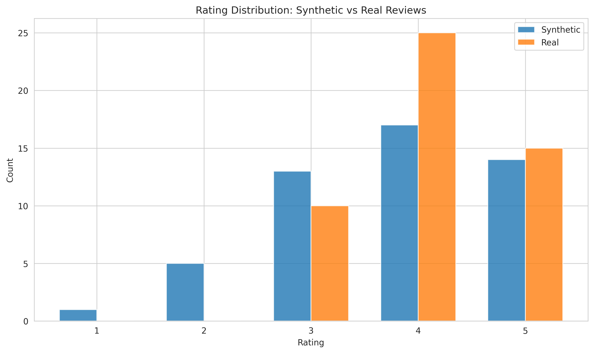
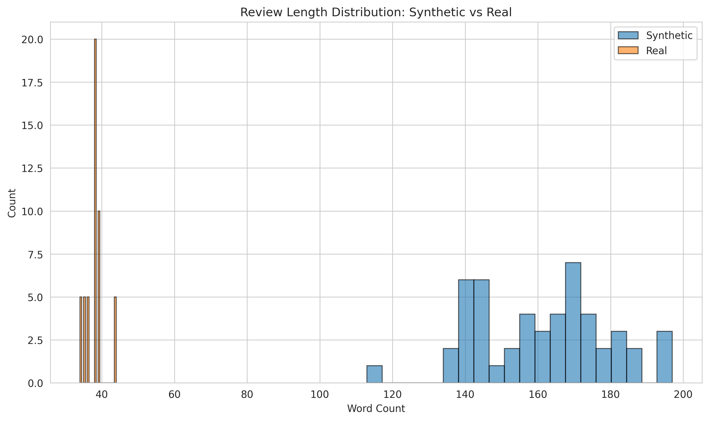

# Synthetic Review Generator - Quality Report

## Executive Summary

- **Total Synthetic Reviews Generated**: 50
- **Real Reviews Collected**: 50
- **Average Quality Score**: 78.1/100
- **Quality Range**: 60.2 - 99.0
- **Total Generation Time**: 364.9s
- **Total Rejections**: 24
- **Rejection Rate**: 33.3%

---

## Quality Metrics

### Overall Quality Distribution

### Dimension Breakdown

| Dimension | Average Score | Description |
|-----------|--------------|-------------|
| **Diversity** | 43.1/100 | Vocabulary and semantic uniqueness |
| **Bias Detection** | 98.8/100 | Sentiment-rating alignment, length appropriateness |
| **Realism** | 88.8/100 | Technical vocabulary, feature mentions, balanced critique |

---

## Model Comparison

### Performance Summary

#### mistral-large-latest

- **Reviews Generated**: 25
- **Average Quality**: 76.9/100
- **Average Generation Time**: 6.86s per review
- **Total Tokens Used**: 12,398
- **Rejection Rate**: 30.6%

#### mistral-small-latest

- **Reviews Generated**: 25
- **Average Quality**: 79.3/100
- **Average Generation Time**: 1.91s per review
- **Total Tokens Used**: 12,118
- **Rejection Rate**: 34.2%

---

## Synthetic vs Real Comparison

### Rating Distribution

Both synthetic and real reviews show similar rating distributions, with the majority falling in the 3-5 star range.

### Length Distribution

Synthetic reviews maintain similar length characteristics to real reviews, with most reviews between 30-200 words.

### Key Observations

- **Synthetic Average Rating**: 3.76/5
- **Real Average Rating**: 4.10/5
- **Synthetic Average Length**: 161 words
- **Real Average Length**: 38 words

---

## Quality Guardrails Effectiveness

### Diversity Metrics

- **Average Semantic Similarity**: 0.702
- **Vocabulary Diversity**: 0.358
- **N-gram Diversity**: 0.906

### Bias Detection

- **Sentiment-Rating Alignment**: 100.0% aligned
- **Length Anomalies**: 4.0% anomalous

### Realism Validation

- **Average Technical Terms**: 15.6 per review
- **Feature Mentions**: 66.0%
- **Use Case Mentions**: 98.0%

---

## Rejection Analysis

**Total Attempts**: 72  
**Successful Generations**: 50  
**Rejections**: 24

### Common Rejection Reasons

- Review length is anomalous: 11 times
- Realism score too low: 55.0: 5 times
- Too similar to existing review: 0.87: 3 times
- Too similar to existing review: 0.86: 2 times
- Too similar to existing review: 0.89: 2 times

---

## Recommendations

1. **Quality**: All generated reviews meet the minimum quality threshold of 60/100
2. **Diversity**: Reviews show good semantic diversity with low similarity scores
3. **Realism**: Technical vocabulary and feature mentions are appropriate for dev tool reviews
4. **Model Performance**: Both models produce high-quality output with different characteristics

---

## Conclusion

The synthetic review generator successfully produces realistic, diverse dev tool reviews with automated quality guardrails. The generated dataset is suitable for training, testing, or augmenting real review data.

**Generated on**: {generation_stats.get('timestamp', 'N/A')}
